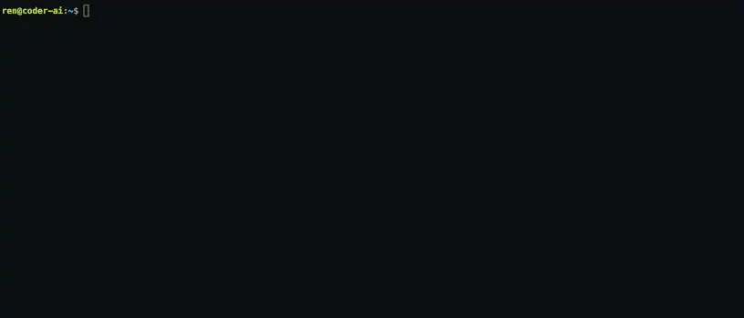

# Termverse

Terminal games that run in your browser.

**Play them here: https://jordanbarker.github.io/termverse/**


Under the hood is a reusable terminal engine (`@tt/core`) that simulates a shell, filesystem, tmux, git, dbt, Snowflake, and Python, all client-side on xterm.js.

## The games

### term-crunch

Timed challenges across tmux, git, filesystem, and vim tracks. A spaced-repetition scheduler makes it easy to review what you're rusty on.

### termoil

A workplace mystery. Learn Linux, git, and a modern data stack as the story unfolds. SSH into a dev container, `git clone` the repo, run `dbt build`, and query Snowflake.



## Local dev

```bash
npm install

npm run dev          # full termverse: both games + landing page
npm run dev:termoil  # termoil dev server only
npm run dev:crunch   # term-crunch dev server only

npm run build        # termoil static export
npm run build:crunch # term-crunch static export
```

## Repo layout

An npm-workspace monorepo:

- `packages/core` (`@tt/core`): the reusable terminal engine.
- `apps/termoil`: the workplace mystery.
- `apps/term-crunch`: the timed challenges.

Built with Next.js (static export), TypeScript, xterm.js, Zustand, and Tailwind.
